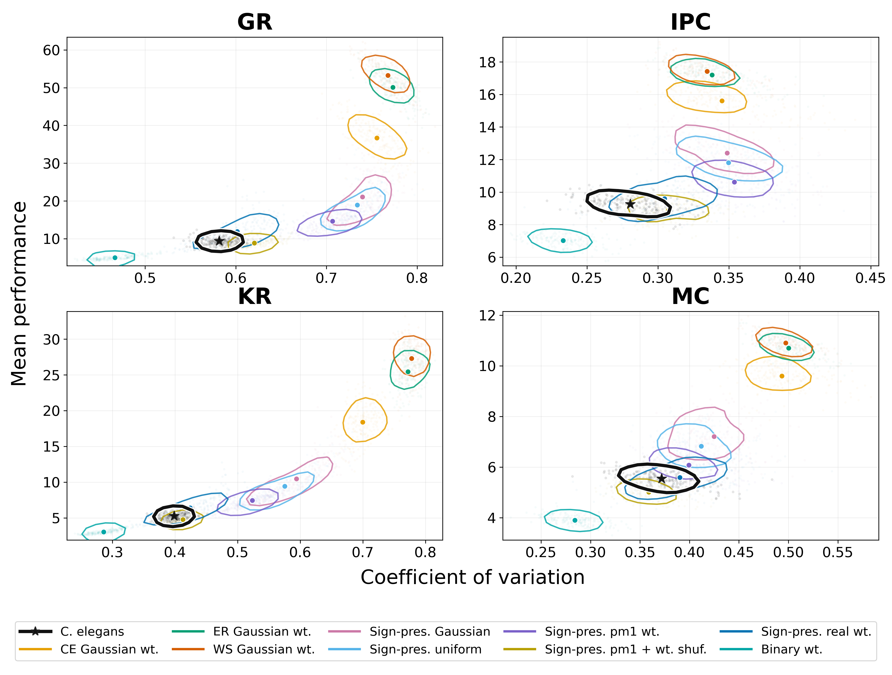
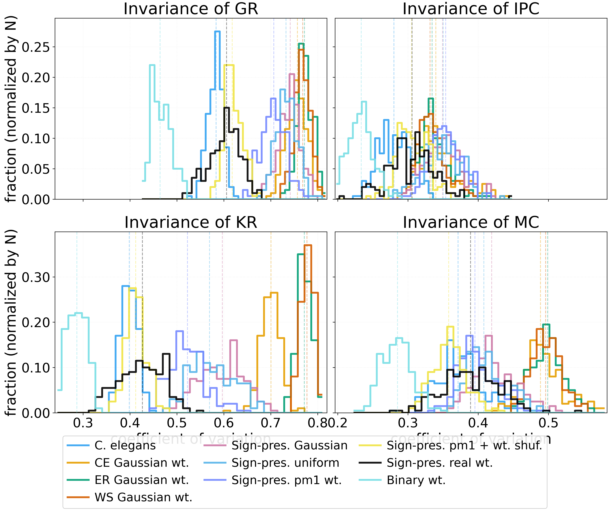
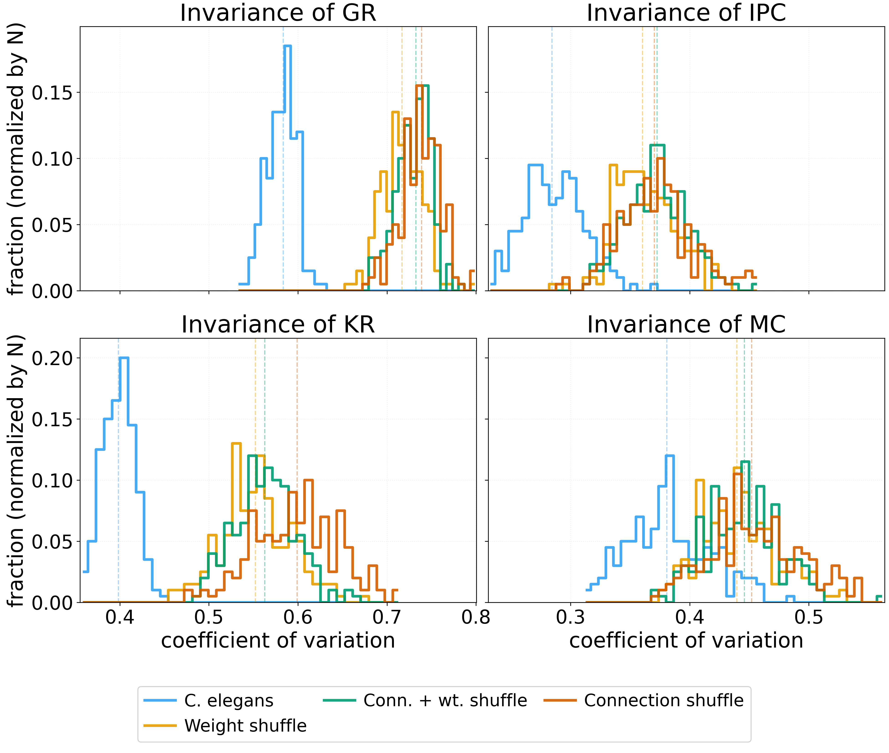
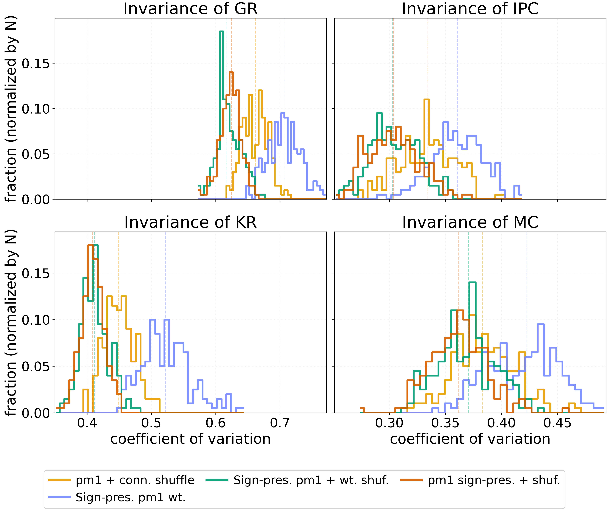
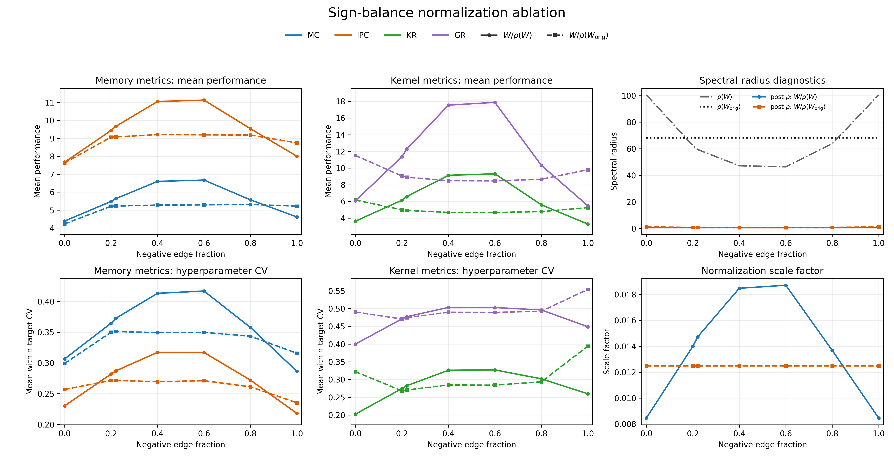
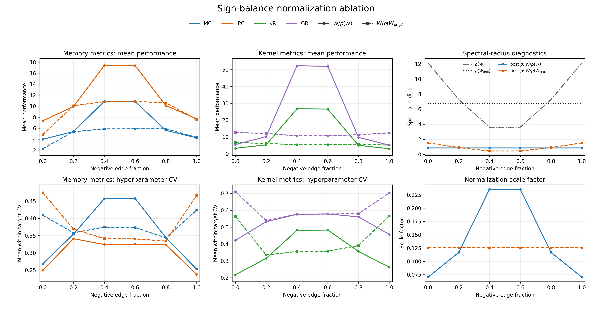
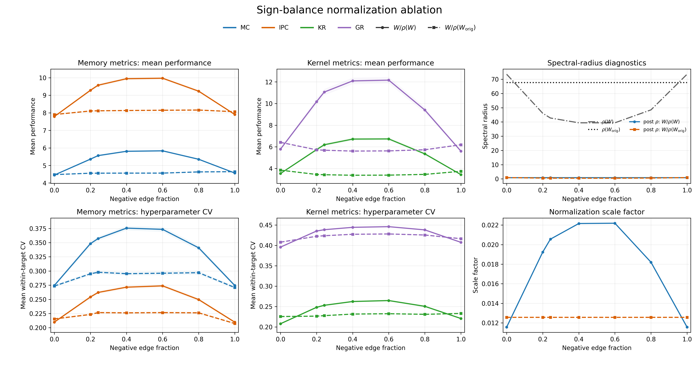

# Brief meeting notes: good results

## Main message

The C. elegans reservoir sits in a distinct invariance--performance regime. It is not simply the highest-performing network, and it is not simply the lowest-CV network. The strongest story is that the biological network preserves relatively low hyperparameter sensitivity while maintaining moderate performance, and the closest controls are the ones that preserve biological sign/weight structure.

## 1. Main structural-control result

**Figure to show:** `good_results/fullv2/50per.png`

This is the cleanest overview figure. It plots coefficient of variation against mean performance for MC, IPC, KR, and GR.

Key points:

- C. elegans is visually separated from the Gaussian ER/WS controls.
- ER/WS/Gaussian controls often move toward higher performance but also much higher CV.
- Binary weights have low CV, but they also change the performance regime, so low CV alone is not the right criterion.
- This figure is better than the older CV-only histograms because it shows the CV--performance tradeoff directly.

Run size:

- `10 modes × 200 trials × 96 hyperparameter settings = 192,000 rows`

## 2. Difference-in-CV tables

**Tables to show/reference:**

- `good_results/fullv2/cv_mean_differences_memory_table.tex`
- `good_results/fullv2/cv_mean_differences_kernel_table.tex`

Best result:

The sign-preserving real-weight control is closest to C. elegans:

| Metric | ΔCV vs C. elegans |
|---|---:|
| MC | +4.95% |
| IPC | +8.61% |
| KR | +6.45% |
| GR | +3.43% |

By contrast, Gaussian random-weight controls are much farther away:

| Control | MC | IPC | KR | GR |
|---|---:|---:|---:|---:|
| ER Gaussian | +34.5% | +20.5% | +93.7% | +32.9% |
| WS Gaussian | +33.7% | +19.3% | +95.2% | +32.0% |

Interpretation:

- Generic random Gaussian weights do not reproduce the C. elegans invariance profile.
- Preserving biological sign/weight organization gets much closer.

Backup visual:

## 3. Shuffle controls

**Tables to show/reference:**

- `good_results/shuf/cv_mean_differences_memory_table.tex`
- `good_results/shuf/cv_mean_differences_kernel_table.tex`

**Figures to show/reference:**

- `good_results/shuf/all_arch_hist_grid.v2.png`
- `good_results/shuf/all_arch_hist_grid.png`

Against C. elegans, shuffling raises CV:

| Shuffle | MC | IPC | KR | GR |
|---|---:|---:|---:|---:|
| Connection shuffle | +18.8% | +29.8% | +50.1% | +26.9% |
| Weight shuffle | +15.4% | +27.1% | +38.8% | +23.3% |
| Conn. + weight shuffle | +16.2% | +30.1% | +41.2% | +25.4% |

Interpretation:

- Both connection organization and weight placement contribute to the C. elegans invariance profile.
- The binary-only topology shuffle has a smaller effect, suggesting topology alone is not the whole story once signs/weights are stripped away.

## 4. Sign-balance normalization ablation

**Figures to show:**

- `good_results/good_cel_new/matched_cel/sign_norm_ablation_combined.png`

Core mechanism test:

- Compare own spectral-radius normalization, `W / rho(W)`, against original-radius normalization, `W / rho(W_orig)`.
- Under `W / rho(W)`, performance peaks around intermediate negative edge fractions.
- Under `W / rho(W_orig)`, the performance bump is much flatter.

For the 4:1 C. elegans network:

- raw spectral radius is high at sign endpoints: about `100.6`
- raw spectral radius drops near balanced signs: about `47`
- own spectral-radius normalization therefore rescales intermediate-balance networks more strongly

Interpretation:

- A large part of the sign-balance performance bump is mediated by spectral-radius changes.
- Sign balance is not just a symbolic sign-count effect; it changes the dynamical scale of the recurrent matrix.

## 5. ER matched sign-balance control

**Figure to show/reference:**

- `good_results/good_cel_new/matched_er/sign_norm_ablation_combined.png`

ER matched shows the spectral-radius mechanism even more strongly:

- raw spectral radius at endpoints: about `12.1`
- raw spectral radius near balanced signs: about `3.6`
- `W / rho(W)` produces large performance bumps
- `W / rho(W_orig)` stays mostly flat

Interpretation:

- Global sign fraction can strongly alter spectral radius in random graphs.
- This supports the normalization-control result, but also shows that spectral-radius effects alone are not specific to the biological topology.

## 6. Removed-connectome result

**Figure to keep as backup/appendix:**

- `good_results/good_cel_new/removed_cel/sign_norm_ablation_combined.png`

Use this as a caveat rather than the lead result.

Interpretation:

- The removed-connectome curve shifts relative to the 4:1 network.
- This suggests the ordering/placement of signs matters, not only the global negative percentage.
- Matching the negative percentage does not necessarily reproduce the biological spectral radius or invariance profile.

## Suggested meeting flow

1. Start with `50per.png`: C. elegans occupies a distinct CV--performance regime.
2. Show the ΔCV tables: sign-preserving real weights are closest to C. elegans.
3. Show shuffle tables: connection and weight organization both matter.
4. Show sign-normalization ablation: much of the sign-balance bump is spectral-radius mediated.
5. Mention ER matched as a mechanism control.
6. Mention removed-connectome as a caveat: global sign fraction is not sufficient.

## Caveat to keep in mind

Be careful when interpreting GR. GR can be useful, but it is especially sensitive to the effective-rank definition and noise-response calculation. The main story should not depend on GR alone; it is strongest when MC, IPC, KR, and GR tell a consistent story.
